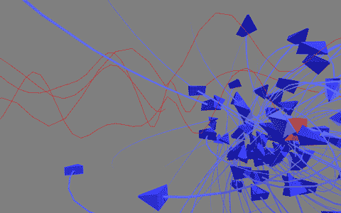

#a First Step of Motion by Code

コードでオブジェクトを動かす最初の一歩。てきな

- ターゲットの位置を動かす(sin,cos,noise)
- ターゲットの位置を追いかけるオブジェクト

##Movement of Target

```csharp
    pos.x = valA * Mathf.Sin(t);
    pos.y = valB * Mathf.PerlinNoise(pos.x, t);
    pos.z = valC * Mathf.Cos(pos.x / valC + t);
    pos * valD * (0.5f + Mathf.Sin(t * 0.1f) * 0.5f);
```
- pos.x = sin(t); & pos.z = cos(t); → Y軸で回転
- pos.yは、PerlinNoiseで上下させる
- valA-valDは変数で、良いくらいの値を探す

##Movement of Fish

```csharp
    var pos = transform.position;
    var toVec = FishTarget.position - pos;
    var toRot = Quaternion.FromToRotation(Vector3.forward, toVec);

    transform.rotation = Quaternion.RotateTowards(transform.rotation, toRot, maxRotateAngle * Time.deltaTime);
    transform.position += transform.forward * speed * Time.deltaTime;
```

- 現在の位置からターゲットまでのベクトルを計算(toVec)
- ターゲットの位置を向く回転(Quaternion)を計算(toRot)
- 最大回転角度(maxRotateAngle)で制限をかけつつ、オブジェクトを回転
- speed分、transformを前方向(transform.forward)へ移動

##Capture Image



##UnityEngine Classes for Create Motion

Unityで、オブジェクトを動かす時に必要になってくるClassたち

これらのクラスを使いこなせると、モノを動かせます！

- [Mathf](http://docs.unity3d.com/ja/current/ScriptReference/Mathf.html) - 数学系関数
- [Vector3](http://docs.unity3d.com/ja/current/ScriptReference/Vector3.html) - 3D上の位置、方向
- [Quaternion](http://docs.unity3d.com/ja/current/ScriptReference/Quaternion.html) - 回転、概念はちょっと難しい
- [Transform](http://docs.unity3d.com/ja/current/ScriptReference/Transform.html) - 実際のオブジェクトの位置、回転、スケールの情報
- [Random](http://docs.unity3d.com/ja/current/ScriptReference/Random.html) - 乱数生成
